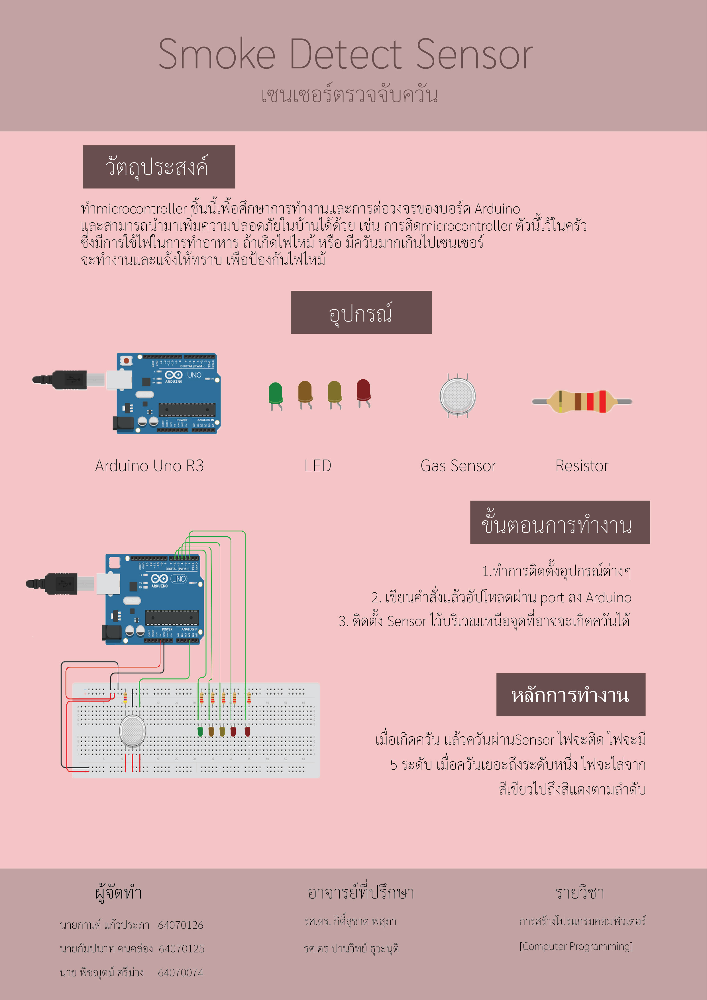

# Gas Detector
> Project Computer Programming IT KMITL 2/2021
# ที่มา
  > พวกเราได้เล็งเห็นถึงปัญหาในครัวเรือน ในกรณีที่แก๊สรั่วไหล พวกเราจึงได้ทำเครื่องตรวจจับแก๊สในอากาศ เพื่อที่จะได้ส่งสัญญาณเตือนว่าในบริเวณนั้นมีแก๊สในอากาศสูง
# วัตถุประสงค์
> เพื่อป้องกันการแพร่กระจายของแก๊สในครัวเรือน โดยใช้  Microcontroller มาตรวจจับแก๊ส
# ประโยชน์ที่ได้รับ
> * ป้องการปัญหาแก๊สรั่วไหลในครัวเรือน ที่จะนำมาสู่อันตราย
> * แจ้งให้ผู้อยู่อาศัย ได้ทราบว่ามีปริมาณแก๊สรั่วไหลหรือไม่
# อุปกรณ์
> * Arduino Uno R3
> * Gas Sensor
> * LED
> * Lesistor
# บทคัดย่อ
> [บทคัดย่อ](https://docs.google.com/document/d/1QJhKXMBHFhQIcRQay6QXLjgT2K9Bn8pqgYMzIpaahwA/edit)
# เว็บที่ใช้ต่อวงจร
> [Tinkercad](https://www.tinkercad.com/things/cs5DJcWUfS2-smoke-detec/editel?sharecode=AQy-P4OdKnqkz5EzkNHKk1oJHeO5jNYHqsHJWZ6XuS0)
# 3D Model
> [Tinkercad](https://www.tinkercad.com/things/4V4M1iAyF9z-gas-detec/edit?sharecode=xNeBRsA9llxn-WhZIB_7XVRFn2TK7EEEOeGhVjHDrWo)
# วิดีโอนำเสนอ
> [Smoke Detect Sensor | IT KMITL Computer Programming Project 2022](https://www.youtube.com/watch?v=h6BTQJ6wfGs&feature=youtu.be)
# โปสเตอร์
>  
### สมาชิก
---
